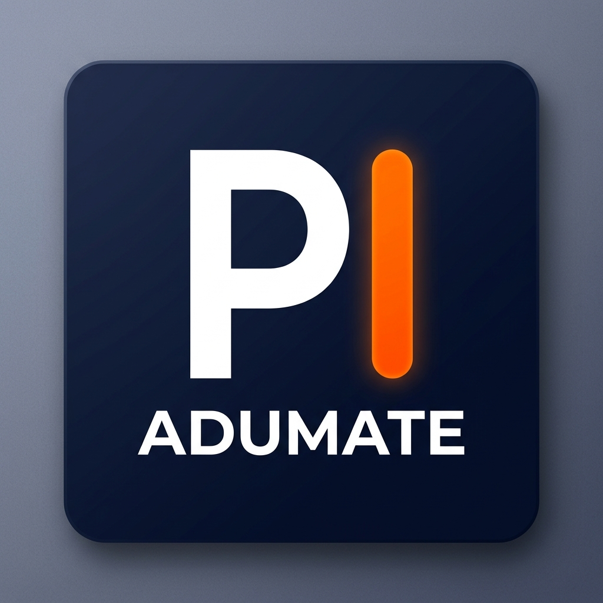
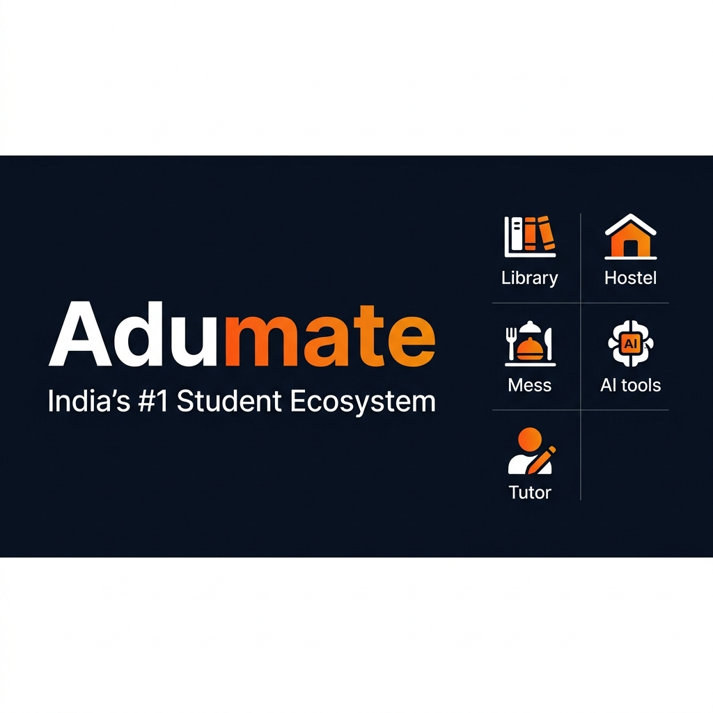

<div align="center">
  

  # 🎓 Adumate
  ### India's #1 Student Ecosystem | Hostels, Libraries, Mess & AI Hub

  [](https://nextjs.org/)
  [](https://firebase.google.com/)
  [](https://deepmind.google/technologies/gemini/)
  [](https://tailwindcss.com/)
  [](https://www.typescriptlang.org/)
  
  *Built to revolutionize the Indian student experience.*
</div>

---

## 🌟 The Adumate Mission & Architectural Vision

**Our Mission:** To democratize access to quality student resources across India. We believe every student deserves a seamless way to find safe accommodation, nutritious food, quiet study spaces, and world-class academic mentorship—all in one place.

**The Architectural Vision:** Adumate is engineered as a highly scalable, AI-first Next.js web application. It integrates robust location-based services with advanced generative AI, ensuring real-time discovery of physical spaces and on-demand digital tutoring via Vidwan AI. The architecture focuses on offline-first capabilities, real-time database syncing via Firebase, and ultra-low latency map rendering for the optimal student experience.

<div align="center">
  
</div>

---

## 🚀 World-Class Features (Everything is Available!)

- 🗺️ **Smart Discovery (Map Integration):** Instantly locate verified Libraries, Hostels, PGs, and Mess facilities near you using intelligent Mapbox/Leaflet integration.
- 🤖 **Vidwan AI Scholar Mentor:** Your personal 24/7 AI tutor. Powered by Google Gemini, Vidwan helps you crack JEE, NEET, and university exams with tailored study plans and doubt resolution.
- 🧠 **AI Knowledge Finder & Tests:** Generate personalized quizzes, track your progress, and pinpoint weak areas with AI-powered analytics.
- 🔐 **Secure & Scalable Backend:** Robust authentication and real-time database powered by Firebase & Firebase Admin.
- ✨ **Stunning UI/UX:** Built with Tailwind CSS and Framer Motion for buttery-smooth animations and a fully responsive, mobile-first design.
- 📚 **Study Hub & Community:** Connect with peers, share resources, and build a collaborative learning environment.

---

## 👨‍💻 Meet the Founder

<div align="center">
  
  
  ### Ayush Kaushik
  **Founder & Lead Architect**

  *"I built Adumate because I experienced the struggles of student life firsthand. My goal is to make every student's journey smoother, smarter, and more successful by building the most comprehensive student ecosystem in the world."*
  
  <p align="center">
    <a href="#"></a>
    <a href="#"></a>
    <a href="#"></a>
  </p>
</div>

---

## 🤖 Vidwan AI: Your Ultimate Study Companion

<div align="center">
  
</div>

Vidwan isn't just an AI; it's a meticulously crafted mentor designed for the Indian education system. Whether you are prepping for board exams or competitive tests like JEE/NEET, Vidwan provides step-by-step guidance, acting as your personal 24/7 tutor.

---

## 🛠️ Tech Stack

Adumate leverages modern, world-class web technologies to deliver a blazing-fast experience:

| Category | Technology |
| :--- | :--- |
| **Frontend Framework** | React 19, Next.js 16 (App Router) |
| **Styling & Animations** | Tailwind CSS v4, Framer Motion, Lucide React, clsx |
| **Backend & Auth** | Firebase (Auth, Firestore, Storage) |
| **Artificial Intelligence**| Google Generative AI (Gemini Pro) |
| **Maps & Geo-location** | Mapbox GL, React Leaflet, React Google Maps |
| **Language** | TypeScript |

---

## ⚙️ Getting Started (Local Development)

Want to run the world's best student platform locally? Follow these steps:

1. **Clone the repository:**
   ```bash
   git clone https://github.com/your-username/adumate.git
   cd adumate/adumate-app
   ```

2. **Install dependencies:**
   ```bash
   npm install
   ```

3. **Set up Environment Variables:**
   Create a `.env.local` file in the root directory and add your Firebase, Mapbox, and Gemini API keys.
   ```env
   NEXT_PUBLIC_FIREBASE_API_KEY=your_api_key
   NEXT_PUBLIC_MAPBOX_TOKEN=your_mapbox_token
   GEMINI_API_KEY=your_gemini_key
   # Add other required keys...
   ```

4. **Run the development server:**
   ```bash
   npm run dev
   ```

5. Open [http://localhost:3000](http://localhost:3000) to see Adumate in action!

---

<div align="center">
  <b>Built with ❤️ for Indian Students by Ayush Kaushik</b>
  <br/>
  &copy; 2026 Adumate Inc. All Rights Reserved.
</div>
